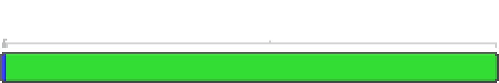
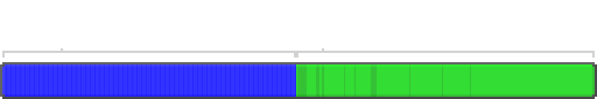

---
navigation:
  parent: ae2-mechanics/ae2-mechanics-index.md
  title: Байты и типы
  icon: creative_item_cell
---

# Байты и типы

<Row>
    <ItemImage id="item_storage_cell_1k" scale="4" />

    <ItemImage id="item_storage_cell_4k" scale="4" />

    <ItemImage id="item_storage_cell_16k" scale="4" />

    <ItemImage id="item_storage_cell_64k" scale="4" />

    <ItemImage id="item_storage_cell_256k" scale="4" />
  </Row>

[Ячейки хранения](../items-blocks-machines/storage_cells.md) определяются как *байтами*, так и *типами*. Байты, как и в реальном компьютере, измеряют общее количество "материала" в ячейке хранения. Типы измеряют, сколько различных *типов* предметов хранится в ячейке. Каждый тип представляет уникальный предмет: например, 4 096 булыжника — это 1 тип, а 16 разных мечей с разными зачарованиями — это 16 типов.

Каждая ячейка хранения может хранить фиксированное количество данных. Каждый тип занимает определённое количество байтов (которое варьируется в зависимости от размера ячейки), а каждый предмет занимает 1 бит памяти. Таким образом, 8 предметов занимают 1 байт, а полный стак из 64 предметов занимает 8 байтов, независимо от того, как предметы складываются вне ME-сети. Например, 64 одинаковых седла занимают столько же места, сколько 64 камня.

Повторюсь: каждый предмет занимает 1 бит, поэтому 8 предметов = 1 байт. Для ячеек с жидкостями это 8 вёдер на байт.

Многие жалуются на ограниченное количество типов, которые может хранить ячейка, но это ***необходимое ограничение***. Ячейки хранят свои данные в NBT-теге самого предмета, что делает их довольно стабильными. Однако это означает, что слишком большой объём данных в ячейке может привести к перегрузке при передаче игроку, вызывая эффект, аналогичный "бану книг" в ванильном Minecraft. Кроме того, слишком много разных типов в системе увеличивает нагрузку на сортировку и обработку предметов. Тем не менее, это ограничение не слишком строгое. Один отсек <ItemLink id="drive" />, заполненный ячейками, — это 630 типов, что на самом деле довольно много, если вы не храните множество уникальных нестакабельных предметов.

По этой причине типы существуют, чтобы "твёрдо отговорить" вас от сброса сотен случайно повреждённых доспехов и инструментов с моб-фермы прямо в ME-систему. Каждый предмет с уникальным уроном и зачарованиями хранится как отдельная запись, что приводит к перегрузке. Рекомендуется отфильтровывать такие предметы до их попадания в систему.

Стремиться сразу к ячейкам высшего уровня — не лучшая идея, так как вы тратите больше ресурсов, но не получаете дополнительного места для типов. Это означает, что ячейки всех размеров остаются полезными даже в поздней игре, поскольку у них есть свои компромиссы.

Ниже приведена таблица, сравнивающая различные уровни ячеек хранения, их ёмкость и приблизительную стоимость.

## Ёмкость ячеек хранения vs стоимость

| Ячейка                                     |   Байты | Типы | Байтов на тип | Кварц | Красный камень | Золото | Светокамень |
| ---------------------------------------- | ------: | ----: | -------------: | -----: | -------: | ---: | --------: |
| <ItemLink id="item_storage_cell_1k" />   |   1,024 |    63 |              8 |      4 |        5 |    1 |         0 |
| <ItemLink id="item_storage_cell_4k" />   |   4,096 |    63 |             32 |  14.25 |       20 |    3 |         0 |
| <ItemLink id="item_storage_cell_16k" />  |  16,384 |    63 |            128 |     45 |       61 |    9 |         4 |
| <ItemLink id="item_storage_cell_64k" />  |  65,536 |    63 |            512 | 137.25 |      184 |   27 |        16 |
| <ItemLink id="item_storage_cell_256k" /> | 262,144 |    63 |           2048 |    414 |      553 |   81 |        48 |

## Ёмкость хранения при разном количестве типов

Начальная стоимость типов такова, что ячейка с 1 типом может хранить в 2 раза больше, чем ячейка со всеми 63 используемыми типами.

| Ячейка                                     | Общая ёмкость при 1 типе | Общая ёмкость при 63 типах |
| ---------------------------------------- | ----------------------------------------: | ------------------------------------------: |
| <ItemLink id="item_storage_cell_1k" />   |                                     8,128 |                                       4,160 |
| <ItemLink id="item_storage_cell_4k" />   |                                    32,512 |                                      16,640 |
| <ItemLink id="item_storage_cell_16k" />  |                                   130,048 |                                      66,560 |
| <ItemLink id="item_storage_cell_64k" />  |                                   520,192 |                                     266,240 |
| <ItemLink id="item_storage_cell_256k" /> |                                 2,080,768 |                                   1,064,960 |

