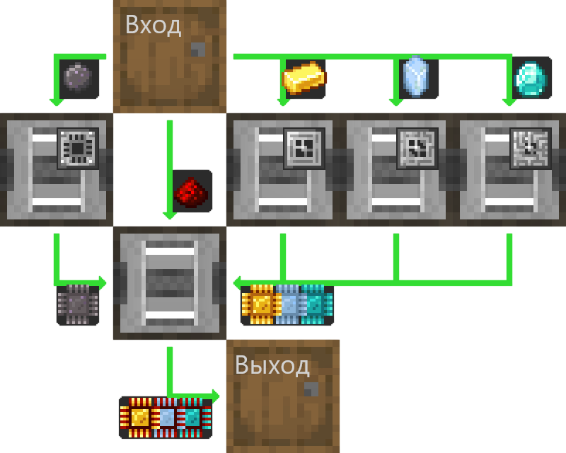

---
navigation:
  parent: example-setups/example-setups-index.md
  title: Автопроизводство процессоров
  icon: inscriber
---

# Автопроизводство процессоров

Существует много способов автоматизации [процессоров](../items-blocks-machines/processors.md), и это один из них.

Эта общая схема может быть реализована с помощью любого типа логистической трубы, канала, воздуховода или как бы это ни называлось в моде,
главное, чтобы можно было фильтровать.

Здесь подробно описано, как это сделать с помощью только AE2, используя [подсети "кабелей"](pipe-subnet.md).

Обратите внимание, что поскольку здесь используется <ItemLink id="pattern_provider" />, он предназначен для интеграции в вашу установку [автоматического крафта](../ae2-mechanics/autocrafting.md).
Если вы просто хотите автоматизировать работу отдельного процессора, замените поставщик шаблонов другой бочкой и поместите ингредиенты непосредственно в верхнюю бочку.

Это случается с обратной совместимостью
с предыдущими версиями AE2, потому что даже если <ItemLink id="inscriber" /> повёрнут, подсети кабелей все равно вставляют и извлекают из правильных граней.

<GameScene zoom="4" interactive={true}>
  <ImportStructure src="../assets/assemblies/processor_automation.snbt" />

  <BoxAnnotation color="#dddddd" min="5 1 0" max="6 2 1" thickness=".05">
        (1) Поставщик шаблонов: настройки по умолчанию, с соответствующими шаблонами обработки.

        <Row>
            
            
            
        </Row>
  </BoxAnnotation>

  <BoxAnnotation color="#dddddd" min="4.7 2 0" max="5 3 1" thickness=".05">
        (2) Шина хранения №1: имеет настройки по умолчанию.
  </BoxAnnotation>

  <BoxAnnotation color="#dddddd" min="4 1 0" max="4.3 2 1" thickness=".05">
        (3) Шина экспорта №1: отфильтрована на кремний, имеет 2 карты ускорения.
        <Row><ItemImage id="silicon" scale="2" /> <ItemImage id="speed_card" scale="2" /></Row>
  </BoxAnnotation>

  <BoxAnnotation color="#dddddd" min="4 4 0" max="4.3 3 1" thickness=".05">
        (4) Шина экспорта №2: отфильтрована на золотой слиток, имеет 2 карты ускорения.
        <Row><ItemImage id="minecraft:gold_ingot" scale="2" /> <ItemImage id="speed_card" scale="2" /></Row>
  </BoxAnnotation>

  <BoxAnnotation color="#dddddd" min="4 5 0" max="4.3 4 1" thickness=".05">
        (5) Шина экспорта №3: отфильтрована на кристалл истинного кварца, имеет 2 карты ускорения.
        <Row><ItemImage id="certus_quartz_crystal" scale="2" /> <ItemImage id="speed_card" scale="2" /></Row>
  </BoxAnnotation>

  <BoxAnnotation color="#dddddd" min="4 6 0" max="4.3 5 1" thickness=".05">
        (6) Шина экспорта №4: отфильтрована на алмаз, имеет 2 карты ускорения.
        <Row><ItemImage id="minecraft:diamond" scale="2" /> <ItemImage id="speed_card" scale="2" /></Row>
  </BoxAnnotation>

  <BoxAnnotation color="#dddddd" min="2.3 3 0" max="2 2 1" thickness=".05">
        (7) Шина экспорта №5: отфильтрована на редстоуновую пыль, имеет 2 карты ускорения.
        <Row><ItemImage id="minecraft:redstone" scale="2" /> <ItemImage id="speed_card" scale="2" /></Row>
  </BoxAnnotation>

  <BoxAnnotation color="#dddddd" min="4 1 0" max="3 2 1" thickness=".05">
        (8) Вырезатель №1: установлены настройки по умолчанию. Установлена кремниевая печать и 4 карты ускорения.
        <Row><ItemImage id="silicon_press" scale="2" /> <ItemImage id="speed_card" scale="2" /></Row>
  </BoxAnnotation>

  <BoxAnnotation color="#dddddd" min="4 3 0" max="3 4 1" thickness=".05">
        (9) Вырезатель №2: установлены настройки по умолчанию. Установлена логическая печать и 4 карты ускорения.
        <Row><ItemImage id="logic_processor_press" scale="2" /> <ItemImage id="speed_card" scale="2" /></Row>
  </BoxAnnotation>

  <BoxAnnotation color="#dddddd" min="4 4 0" max="3 5 1" thickness=".05">
        (10) Вырезатель №3: установлены настройки по умолчанию. Установлена вычислительная печать и 4 карты ускорения.
        <Row><ItemImage id="calculation_processor_press" scale="2" /> <ItemImage id="speed_card" scale="2" /></Row>
  </BoxAnnotation>

  <BoxAnnotation color="#dddddd" min="4 5 0" max="3 6 1" thickness=".05">
        (11) Вырезатель №4: установлены настройки по умолчанию. Установлена инженерная печать и 4 карты ускорения.
        <Row><ItemImage id="engineering_processor_press" scale="2" /> <ItemImage id="speed_card" scale="2" /></Row>
  </BoxAnnotation>

  <BoxAnnotation color="#dddddd" min="2 2 0" max="1 3 1" thickness=".05">
        (12) Вырезатель №5: настройки по умолчанию, установлены 4 карты ускорения.
        <ItemImage id="speed_card" scale="2" />
  </BoxAnnotation>

  <BoxAnnotation color="#dddddd" min="2.7 2 0" max="3 1 1" thickness=".05">
        (13) Шина импорта №1: настройки по умолчанию, установлены 2 карты ускорения.
        <ItemImage id="speed_card" scale="2" />
  </BoxAnnotation>

  <BoxAnnotation color="#dddddd" min="2.7 4 0" max="3 3 1" thickness=".05">
        (14) Шина импорта №2: настройки по умолчанию, установлены 2 карты ускорения.
        <ItemImage id="speed_card" scale="2" />
  </BoxAnnotation>

  <BoxAnnotation color="#dddddd" min="2.7 5 0" max="3 4 1" thickness=".05">
        (15) Шина импорта № 3: настройки по умолчанию, установлены 2 карты ускорения.
        <ItemImage id="speed_card" scale="2" />
  </BoxAnnotation>

  <BoxAnnotation color="#dddddd" min="2.7 6 0" max="3 5 1" thickness=".05">
        (16) Шина импорта №4: настройки по умолчанию, установлены 2 карты ускорения.
        <ItemImage id="speed_card" scale="2" />
  </BoxAnnotation>

  <BoxAnnotation color="#dddddd" min="2 3 0" max="1 3.3 1" thickness=".05">
        (17) Шина хранения №2: установлены настройки по умолчанию
  </BoxAnnotation>

  <BoxAnnotation color="#dddddd" min="2 1.7 0" max="1 2 1" thickness=".05">
        (18) Шина хранения №3: установлены настройки по умолчанию.
  </BoxAnnotation>

  <BoxAnnotation color="#dddddd" min="1 2 0" max="0.7 3 1" thickness=".05">
        (19) Шина импорта №5: настройки по умолчанию, установлены 2 карты ускорения.
        <ItemImage id="speed_card" scale="2" />
  </BoxAnnotation>

  <BoxAnnotation color="#dddddd" min="5 0.7 0" max="6 1 1" thickness=".05">
        (20) Шина хранения №4: установлены настройки по умолчанию.
  </BoxAnnotation>

<BoxAnnotation color="#dddddd" min="3.3 2.7 0.3" max="3.7 3 0.7" thickness=".05">
        Кварцевое волокно питает все 3 вырезателя, поскольку вырезатели действуют как кабели и, таким образом, передают энергию.
  </BoxAnnotation>

<DiamondAnnotation pos="7 1.5 0.5" color="#00ff00">
        В основную сеть
    </DiamondAnnotation>

  <IsometricCamera yaw="185" pitch="5" />
</GameScene>

## Настройки

* У <ItemLink id="pattern_provider" /> (1) установлены настройки по умолчанию с соответствующими предметами в <ItemLink id="processing_pattern" />.

  
  
  

* У <ItemLink id="storage_bus" /> (2, 17, 18, 20) установлены настройки по умолчанию.
* <ItemLink id="export_bus" /> (3-7) отфильтрованы по соответствующему ингредиенту. Установлено 2 <ItemLink id="speed_card" />.
    <Row>
      <ItemImage id="silicon" scale="2" />
      <ItemImage id="minecraft:gold_ingot" scale="2" />
      <ItemImage id="certus_quartz_crystal" scale="2" />
      <ItemImage id="minecraft:diamond" scale="2" />
      <ItemImage id="minecraft:redstone" scale="2" />
    </Row>
* У <ItemLink id="import_bus" /> (13-16, 19) установлены настройки по умолчанию. Установлено 2 <ItemLink id="speed_card" />.
* У <ItemLink id="inscriber" /> установлены настройки по умолчанию. Установлены соответствующие [печати](../items-blocks-machines/presses.md),
   и 4 <ItemLink id="speed_card" />.
   <Row>
     <ItemImage id="silicon_press" scale="2" />
     <ItemImage id="logic_processor_press" scale="2" />
     <ItemImage id="calculation_processor_press" scale="2" />
     <ItemImage id="engineering_processor_press" scale="2" />
   </Row>

## Как это работает

1. <ItemLink id="pattern_provider" /> заталкивает ингредиенты в бочку.
2. Первая [подсеть кабелей](pipe-subnet.md) (оранжевая) извлекает кремний, редстоуновую пыль и соответствующий ингредиент процессора
   (золотой слиток, кристалл истинного кварца или алмаз) из бочки и помещает их в соответствующий <ItemLink id="inscriber" />.
3. Первые четыре <ItemLink id="inscriber" /> образуют <ItemLink id="printed_silicon" /> и <ItemLink id="printed_logic_processor" />,
   <ItemLink id="printed_calculation_processor" />, или <ItemLink id="printed_engineering_processor" />.
4. Вторая и третья [подсеть кабелей](pipe-subnet.md) (зеленые) извлекают печатные платы из первых четырех <ItemLink id="inscriber" />
    и помещают их в пятую, конечную сборку <ItemLink id="inscriber" />.
5. Пятый <ItemLink id="inscriber" /> собирает [процессор](../items-blocks-machines/processors.md).
6. Четвертая [подсеть кабелей](pipe-subnet.md) (фиолетовая) помещает процессор в поставщик шаблонов, возвращая его в основную сеть.