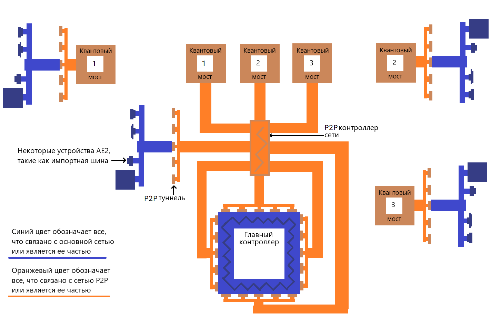

---
navigation:
  parent: items-blocks-machines/items-blocks-machines-index.md
  title: P2P Туннели
  icon: me_p2p_tunnel
  position: 210
categories:
- devices
item_ids:
- ae2:me_p2p_tunnel
- ae2:redstone_p2p_tunnel
- ae2:item_p2p_tunnel
- ae2:fluid_p2p_tunnel
- ae2:fe_p2p_tunnel
- ae2:light_p2p_tunnel
---

# Туннели "Точка-Точка"

<GameScene zoom="6" background="transparent">
  <ImportStructure src="../assets/assemblies/p2p_tunnels.snbt" />
  <IsometricCamera yaw="195" pitch="30" />
</GameScene>

P2P туннели — это способ перемещения таких вещей, как предметы, жидкости, сигналы редстоуна, энергия, свет и [каналы](../ae2-mechanics/channels.md)
по сети без их прямого взаимодействия с сетью. Существует много вариантов P2P туннелей, но каждый из них
передает только определенный тип данных. По сути, они действуют как порталы, которые напрямую соединяют
две грани блоков на расстоянии. Они не являются двунаправленными, у них есть определенные входы и выходы.

Например, воронка, обращенная к предметному P2P, будет действовать так, как если бы он был напрямую подключен к бочке, и предметы будут идти.

<GameScene zoom="4" background="transparent">
  <ImportStructure src="../assets/assemblies/p2p_hopper_barrel.snbt" />
  <IsometricCamera yaw="195" pitch="30" />
</GameScene>

Однако две бочки, расположенные рядом друг с другом, не будут передавать предметы между собой.

<GameScene zoom="4" background="transparent">
  <ImportStructure src="../assets/assemblies/p2p_barrel_barrel.snbt" />
  <IsometricCamera yaw="195" pitch="30" />
</GameScene>

Существуют также другие варианты, такие как редстоун P2P.

<GameScene zoom="4" background="transparent">
  <ImportStructure src="../assets/assemblies/p2p_redstone.snbt" />
  <IsometricCamera yaw="195" pitch="30" />
</GameScene>

## Типы P2P туннелей и настройка

<GameScene zoom="6" background="transparent">
  <ImportStructure src="../assets/assemblies/p2p_tunnels.snbt" />
  <IsometricCamera yaw="180" pitch="90" />
</GameScene>

Существует много типов P2P туннелей. Только МЭ P2P туннель можно создать напрямую, остальные создаются правой кнопкой мыши.

P2P туннели с определенными предметами:
- МЭ P2P туннели выбираются щелчком правой кнопкой мыши по любому [кабелю](../items-blocks-machines/cables.md).
- Редстоун P2P выбираются щелчком правой кнопкой мыши с различными редстоун компонентами.
- Предметные P2P туннели выбираются щелчком правой кнопкой мыши с сундуком или воронкой.
- Жидкостные P2P туннели выбираются щелчком правой кнопкой мыши с ведром или бутыльком.
- Энергетические P2P туннели выбираются щелчком правой кнопкой мыши с практически любым предметом, содержащем энергию.
- Светлые P2P туннели выбираются щелчком правой кнопкой мыши с факелом или светящимся камнем

Некоторые типы туннелей имеют особенности. Например, каналы МЭ P2P туннелей не могут проходить через другие МЭ P2P туннели, а
Энергетические туннели P2P косвенно взимают налог в размере 2,5% с FE, проходящего через них, путем увеличения своего
потребления [энергии](../ae2-mechanics/energy.md).

## Наиболее используемая форма P2P

Наиболее распространенным случаем использования P2P туннелей является использование MЭ P2P туннели для уплотнения плотности транспорта [канала](../ae2-mechanics/channels.md).
Вместо пучка непрозрачных кабелей можно использовать один непрозрачный кабель для передачи многих каналов.

В этом примере 8 входов MЭ P2P принимают 256 каналов (8*32) от <ItemLink id="controller" /> основной сети, а 8 выходов MЭ P2P 
выводят их в другое место. Обратите внимание, что каждый вход или выход P2P туннеля занимает 1 канал. Таким образом, мы можем пропустить много каналов 
через тонкий кабель. А поскольку наши P2P туннели находятся в выделенной [подсети](../ae2-mechanics/subnetworks.md), мы даже не
используем для этого каналы основной сети! Также обратите внимание, что хотя P2P туннели могут быть размещены непосредственно
рядом с контроллером, между ними можно разместить [непрозрачный умный кабель](../items-blocks-machines/cables.md#smart-cable), чтобы легче визуализировать каналы.

<GameScene zoom="4" interactive={true}>
  <ImportStructure src="../assets/assemblies/p2p_compact_channels.snbt" />

  <BoxAnnotation color="#dddddd" min="1.3 1.3 6.3" max="2 2.7 6.7">
        Кварцевое волокно распределяет энергию между основной сетью и подсетью P2P.
  </BoxAnnotation>

  <IsometricCamera yaw="225" pitch="30" />
</GameScene>

Другой пример (включая его с использованием [Квантовых мостов](quantum_bridge.md)) см. на этой схеме, нарисованной в MS Paint, которую я не хочу
дорабатывать:

## Вложение

Однако вы не можете использовать это для передачи бесконечного количества каналов по одному кабелю. Канал для МЭ P2P туннеля не будет
проходить через другой MЭ P2P туннель, поэтому вы не можете вкладывать их друг в друга рекурсивно. Обратите внимание, что внешний слой МЭ P2P туннелей
на красных кабелях находится в автономном режиме. Обратите внимание, что это относится только к MЭ P2P туннелям, другие типы P2P туннелей могут проходить через MЭ P2P туннель,
как видно из нормальной работы Редстоун P2P туннелей.

<GameScene zoom="4" background="transparent">
  <ImportStructure src="../assets/assemblies/p2p_nesting.snbt" />
  <IsometricCamera yaw="225" pitch="30" />
</GameScene>

## Связывание

<GameScene zoom="6" background="transparent">
  <ImportStructure src="../assets/assemblies/p2p_linking_frequency.snbt" />
  <IsometricCamera yaw="195" pitch="30" />
</GameScene>

Концы P2P туннельного соединения можно соединить с помощью <ItemLink id="memory_card" />. Частота будет отображаться
в виде массива цветов 2x2 на задней стороне туннеля.
- Нажмите Shift + правую кнопку мыши, чтобы сгенерировать новую частоту P2P связи.
- Нажмите правую кнопку мыши, чтобы вставить настройки, карты улучшения или частоту связи.

Туннель, на который вы щелкнули правой кнопкой мыши с нажатой клавишей Shift, будет входом, а туннель, на который вы щелкнули правой кнопкой мыши, будет выходом. Вы можете иметь несколько выходов,
но в МЭ P2P туннелях  каналы, проходящие через вход, будут разделены между выходами, поэтому вы не можете дублировать каналы.

## Рецепт

<RecipeFor id="me_p2p_tunnel" />